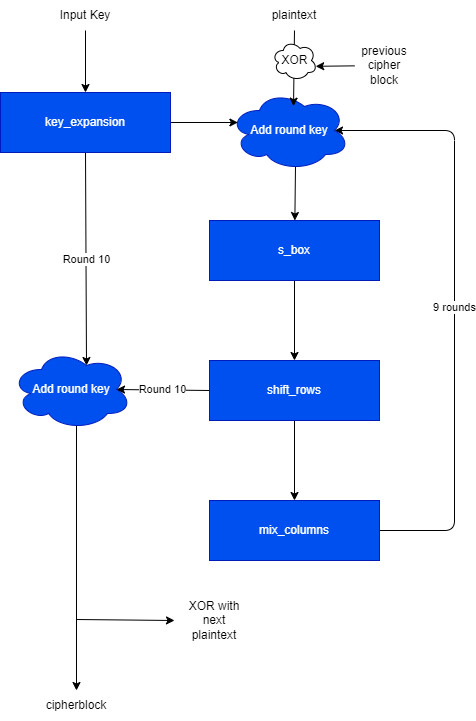

# AES-128
# Introduction
AES is a symmetric-key encryption algorithm based on a design principle known as a substitution-permutation network. Refer to [FIPS-197](https://csrc.nist.gov/pubs/fips/197/final) for detailed specifications. This project implements AES-128 on an inexpensive IO-limited FPGA using Cipher Block Chaining (CBC).

<!-- ### Figure 1: AES CBC Mode (Encryption)

### Figure 2: AES CBC Mode (Decryption)
 -->

### Figure 1: AES Encrypt Block Diagram

# Components
The design is broken up into the following components:

- aes_pkg
    - Contains constant declarations and useful functions that are used across different components.
- key_expansion
    - Expands the initial key into a total of 10 round keys as per FIPS-197.
- s_box
    - Outputs the affine transformation of the multiplicative inverse in the Galois field 2^8 of the input byte(s). Uses the LUT method, supports variable input bus width.
- shift_rows
    - Shifts the rows of the state array as per FIPS-197.
- mix_columns
    - Mixes the columns of the state array as per FIPS-197.
- inv_s_box
    - Inverse of s_box
- inv_shift_rows
    - Inverse of shift_rows
- inv_mix_columns
    - Inverse of mix_columns
- aes_128_top_enc
    - Implements cipher block chaining mode encryption.
- aes_128_top_dec
    - Implements cipher block chaining mode decryption.
- [aes_128_top_wrapper](doc/aes_128_top_wrapper.md)
    - Implements the external interface and instantiates encryption/decryption top levels. 
- [aes_128_top_wrapper_simple](doc/aes_128_top_wrapper_simple.md)
    - A simple version of the above, which directly exposes interfaces to aes_128_top_enc and aes_128_top_dec on the port map. Ideal for use with registers implemented in a top level.
