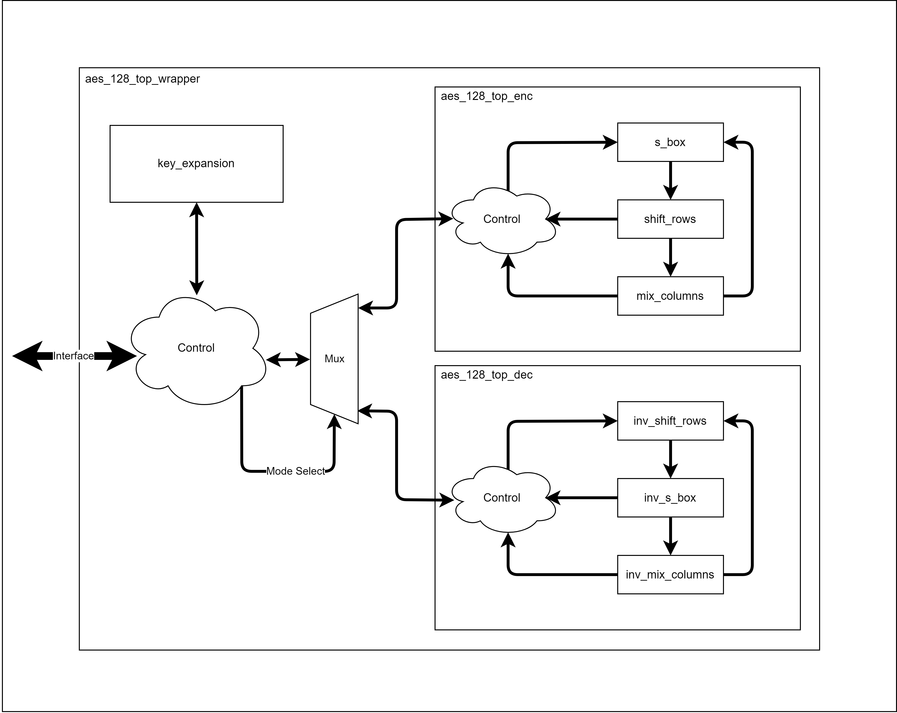

# Introduction
AES is a symmetric-key encryption algorithm based on a design principle known as a substitution-permutation network. Refer to [FIPS-197](https://csrc.nist.gov/pubs/fips/197/final) for detailed specifications. This project implements AES-128 on an inexpensive IO-limited FPGA using Cipher Block Chaining (CBC).

<!-- ### Figure 1: AES CBC Mode (Encryption)

### Figure 2: AES CBC Mode (Decryption)
 -->

### Figure 1: AES Encrypt Block Diagram

# Components
The design is broken up into the following components:

- aes_128_top_wrapper
    - Implements the external interface and instantiates encryption/decryption top levels.
- aes_128_top_enc
    - Implements cipher block chaining mode encryption.
- aes_128_top_dec
    - Implements cipher block chaining mode decryption.
- aes_pkg
    - Contains constant declarations and useful functions that are used across different components.
- key_expansion
    - Expands the initial key into a total of 10 round keys as per FIPS-197.
- s_box
    - Outputs the affine transformation of the multiplicative inverse in the Galois field 2^8 of the input byte(s). Uses the LUT method, supports variable input bus width.
- shift_rows
    - Shifts the rows of the state array as per FIPS-197.
- mix_columns
    - Mixes the columns of the state array as per FIPS-197.
- inv_s_box
    - Inverse of s_box
- inv_shift_rows
    - Inverse of shift_rows
- inv_mix_columns
    - Inverse of mix_columns

These components are arranged in the following way, with additional logic where necessary:
### Figure 2: Block Diagram

# External Interface

For detailed information on the external interface, refer to the [interface specification](external_interface.md).

| Name       | Width | Direction | Description 
|------------|-------|-----------|------------
| clk        | 1     | In        | External reference clock
| reset      | 1     | In        | External reset
| valid      | 1     | In        | When asserted, data bus is valid
| authorized | 1     | In        | User side handshaking signal
| done       | 1     | Out       | FPGA side handshaking signal
| data_bus   | 32    | In/Out    | Data bus, can be driven by user or FPGA depending on state of handshake signals

# Simulation Instructions

To run testbenches, follow the [environment setup](env-setup.md). Debian on WSL was used for the setup instructions, but the basic steps should remain the same.

Run `python3 {testname.py}` to run a test. `aes_128_top_wrapper_test.py` interfaces with `aes_128_top_wrapper.vhdl` through the external interface and implements three tests:

1. Tests the DUT based on FIPS-197 Appendix B, with one round of encryption and decryption.
2. Tests the DUT using random initial vector, key, and plaintext, with one round of encryption and decryption.
3. Tests the CBC mode of the DUT, encrypting and decrypting a string of words. Checks the outputs against the same string encrypted with the "pycryptodome" python library.