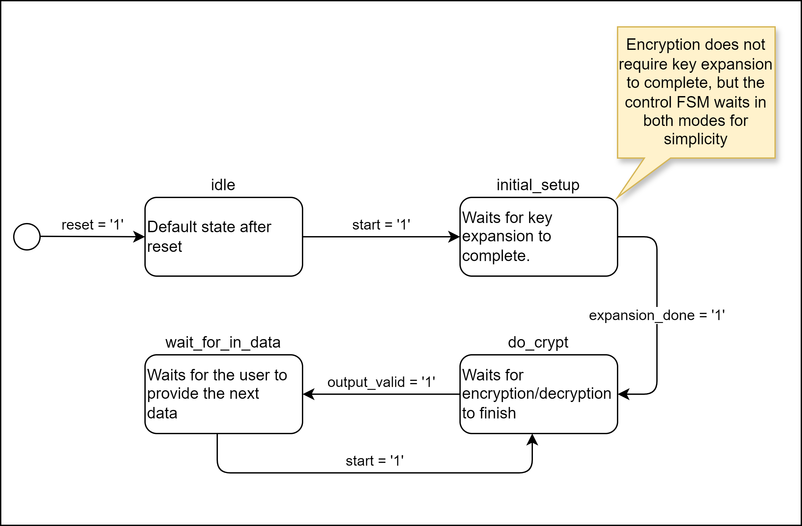

# aes_128_top_wrapper_simple
# Block Diagram

# External Interface

**Table 1: Generic Parameters**

| Name              | Type   | Default  | Description 
|-------------------|--------|----------|------------
| MODE              | string | -        | Operating mode:  "ENC" - Only the encryption interface will be active.   "DEC" - Only the decryption interface will be active.   "ENC_DEC" - Both the encryption and decryption interfaces will be active. 
| SBOX_ARCHITECTURE | string | "LOOKUP" | S-box implementation:   "LOOKUP" - The S-Box uses a look-up table approach where the multiplicative inverse + affine transformation is stored in ROM (registers). 1 clock cycle latency.   "COMB" - The S-Box and affine transformations are implemented combinationally, with four internal pipeline stages. 4 clock cycle latency.   "MASKED" (FUTURE) - Uses a hybrid masked approach. At each session end (and at reset/power on), the masked S-Box will be calculated and written to BRAM (this process takes ~64 clock cycles). Once this process is done, operates with a 1 clock cycle latency. This method eliminates pipeline delays from fully combinational masked approaches, but requires a longer time to initialize. The new mask is generated at each session end to take advantage of any delays between session stop/start to perform the lengthy RAM initialization.

**Table 2: Port Map**

| Name           | Width | Direction | Description 
|----------------|-------|-----------|------------
| clk            | 1     | In        | External reference clock
| reset_enc      | 1     | In        | Synchronous reset for encryption logic
| reset_dec      | 1     | In        | Synchronous reset for decryption logic
|**Encryption Interface**|||
| init_vec_enc    | 128   | In        | Initial vector
| key_enc         | 128   | In        | Key
| plaintext_enc   | 128   | In        | Plaintext
| cipherblock_enc | 128   | Out       | Encrypted plaintext
| start_enc       | 1     | In        | Start signal
| done_enc        | 1     | Out       | Done signal
|**Decryption Interface**|||
| init_vec_dec    | 128   | In        | Initial vector
| key_dec         | 128   | In        | Key
| cipherblock_dec | 128   | In        | Cipherblock to decrypt
| plaintext_dec   | 128   | Out       | Decrypted plaintext
| start_dec       | 1     | In        | Start signal
| done_dec        | 1     | Out       | Done signal

## Control Scheme Specifications
Both encryption and decryption interfaces work the same way. Inputs should be registered. Outputs are registered internally:
1. Place the initial vector on `init_vec_*`.
2. Place the key on `key_*`.
3. Place the first plaintext/cipherblock on `plaintext_enc`/`cipherblock_dec`.
4. Pulse `start_*`.
5. Once `done_*` asserts, place the next plaintext on plaintext_enc and pulse `start_*` again. `done_*` will automatically deassert.
6. Repeat the sequence until all plaintexts are encrypted.
7. To change the initial vector and/or key, pulse reset and repeat steps (1-6).

Two copies of the same FSM are used to control encryption and decryption:

# Simulation Instructions
To run testbenches, follow the [environment setup](env-setup.md). Debian on WSL was used for the setup instructions, but the basic steps should remain the same.

Run `python3 {testname.py}` to run a test. `aes_128_top_wrapper_simple_test.py` interfaces with `aes_128_top_wrapper_simple.vhdl` through the external interface and implements three tests:

1. Tests the DUT based on FIPS-197 Appendix B, with one round of encryption and decryption.
2. Tests the DUT using random initial vector, key, and plaintext, with one round of encryption and decryption.
3. Tests the CBC mode of the DUT, encrypting and decrypting a string of words. Checks the outputs against the same string encrypted with the "pycryptodome" python library.