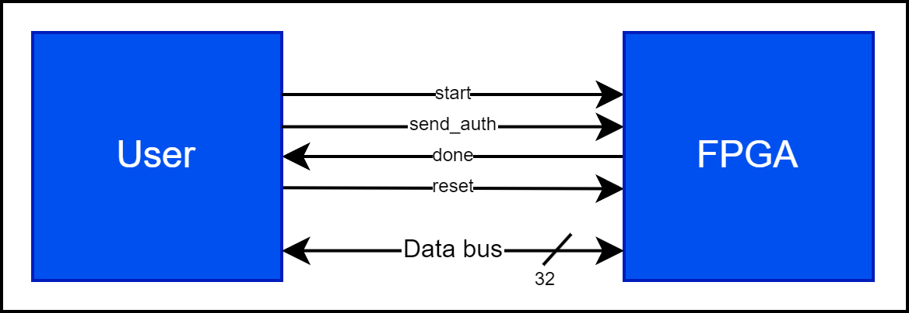

# Introduction
This document provides a guide to the interface used by aes_128_top_wrapper.

# Specifications

There is a single 32-bit I/O bus, along with 4 control signals. Depending on the state of the control signals, the bus can be driven by either the master (user) or the slave (FPGA).

### Figure 1: Block Diagram

### Table 1: Signals

|  Signal   | Width | In/Out        |           Description             | 
|-----------|-------|---------------|-----------------------------------|
| data_bus  | 32    | In/Out (FPGA) | Data bus                          |
| start     | 1     | In            | Handshaking signal                |
| done      | 1     | Out           | Handshaking signal                |
| send_auth | 1     | In            | Authorizes FPGA to drive data_bus |
| reset     | 1     | In            | Synchronus reset                  |

## Encryption
1. The user shall begin by toggling `reset` over at least 1 clock cycle. The FPGA shall exit reset in encryption mode.
2. The user shall populate the data bus with the first 4 bytes of the initial vector and assert `start`. 
    - The data bus shall use little endianness. 
    - The data bus shall remain valid while `start` is asserted. 
3. The user shall repeat the handshaking sequence in (2), transmitting first the initial vector, then the key, and finally the first plaintext.
4. The user shall assert `send_auth` to indicate it is ready to receive the cipherblock. 
    - While `send_auth` is asserted, the FPGA shall drive the data bus. 
5. The user shall wait for `done` to assert, indicating valid data. Once it has read the data bus, the user shall pulse `start` to advance to the next 4 bytes of the cipherblock.
    - The data bus shall use little endianness.
    - The data bus shall remain valid while `done` is asserted.
6. The handshaking sequence in (4) shall be repeated until the cipherblock has been transmitted.
7. Once the cipherblock has been egressed from the FPGA, the user may begin transmitting a new plaintext using the sequence in (2) and (3), transmitting only the key and plaintext.
8. To change the initial vector, the user shall start from (1).

## Decryption
1. The user shall begin by toggling `reset` over at least 1 clock cycle.
2. The user shall assert `start` and `send_auth` for at least 5 clock cycles. Upon seeing this sequence, the FPGA shall switch to decryption mode.
3. The user shall populate the data bus with the first 4 bytes of the initial vector and assert `start`. 
    - The data bus shall use little endianness. 
    - The data bus shall remain valid while `start` is asserted. 
4. The user shall repeat the handshaking sequence in (2), transmitting first the initial vector, then the key, and finally the first cipherblock.
5. The user shall assert `send_auth` to indicate it is ready to receive the plaintext. 
    - While `send_auth` is asserted, the FPGA shall drive the data bus. 
6. The user shall wait for `done` to assert, indicating valid data. Once it has read the data bus, the user shall pulse `start` to advance to the next 4 bytes of the plaintext.
    - The data bus shall use little endianness.
    - The data bus shall remain valid while `done` is asserted.
7. The handshaking sequence in (4) shall be repeated until the plaintext has been transmitted.
8. Once the plaintext has been egressed from the FPGA, the user may begin transmitting a new cipherblock using the sequence in (2) and (3), transmitting only the key and cipherblock.
